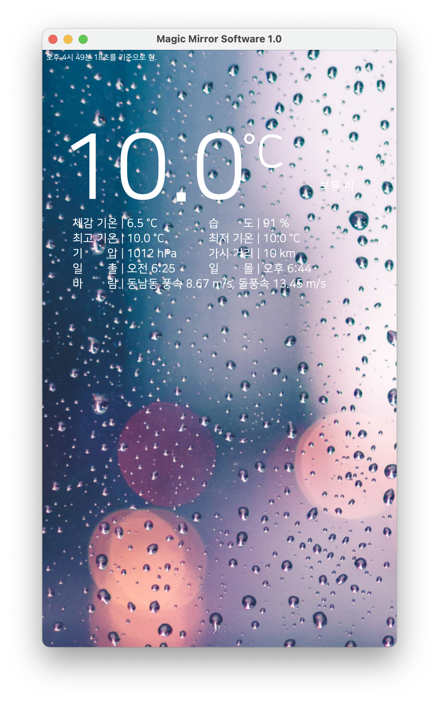

# Weather Display
This is what I made when I was in the 2nd grade of high school.  
This tells you what the weather is like now. (Region: Yeosu)  
I used ``JSONParser``, ``Thread``, ``Swing``, ``Weather API`` and etc.

